# MIXIES

Deployed Url: https://mixies.fly.dev/spirits
 
Overview:
 
Mixies is a fullstack application that provides the user with all of the information they need to create delicious cocktails. The user has the ability to make an account, create and save their own cocktail creations, and leave reviews on existing cocktail recipes.
 
 
Technologies Used:
 
- HTML
- CSS
- Bootstrap
- Javascript
- Express 
- LiquidJS 
- NPM
- Node.js
- MongoDB 
 
 

User Story:
 
As a user I want the ability to:
- sign up.
- sign in. 
- view a database of cocktails.
- create my own cocktail recipes. 
- edit my own cocktail recipes. 
- delete my own cocktail recipes. 
- view all of my own cocktail recipes.
- view recipes others have created.  
- leave reviews on all cocktail recipes including rating (1-5) and a comment.
- delete my existing reviews on all cocktail recipes.
 
 

Entity Relationship Diagram:
 

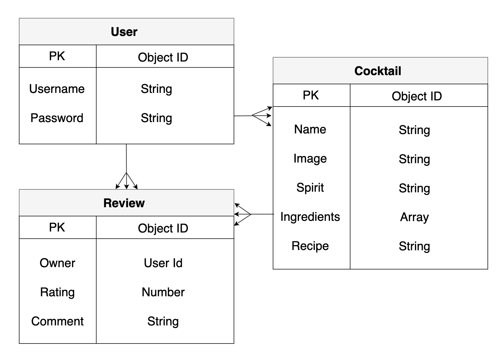
 
 

Wireframe:
 

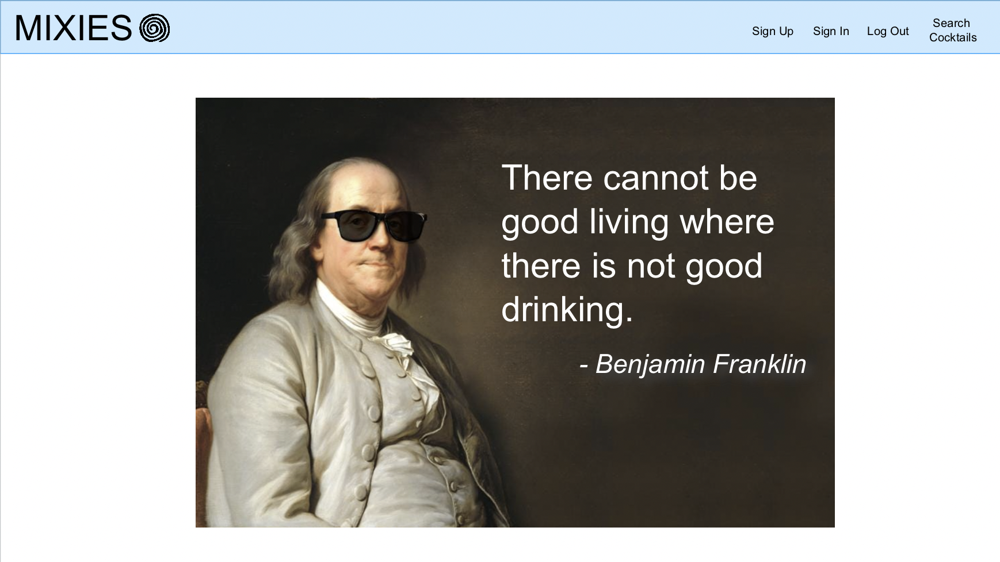
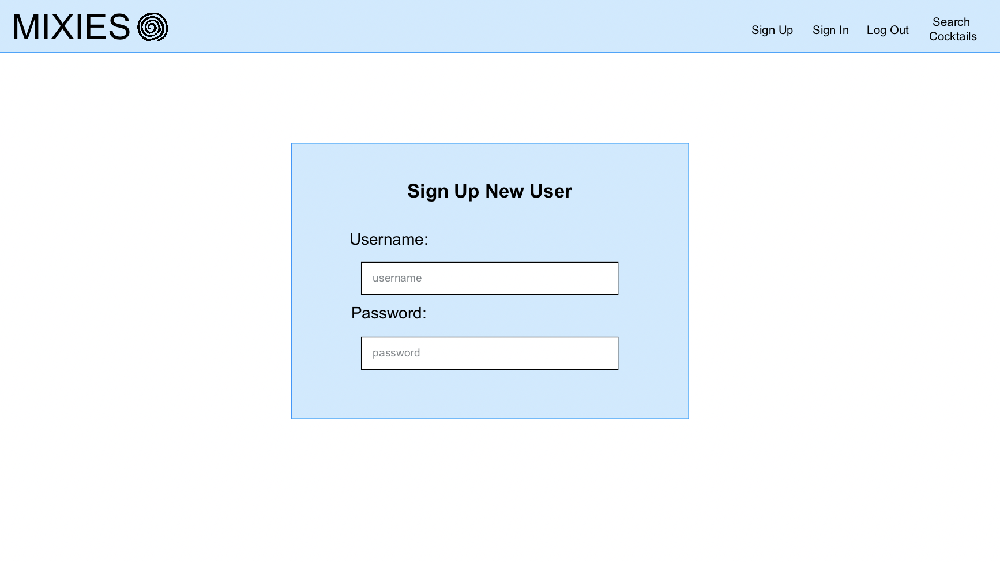
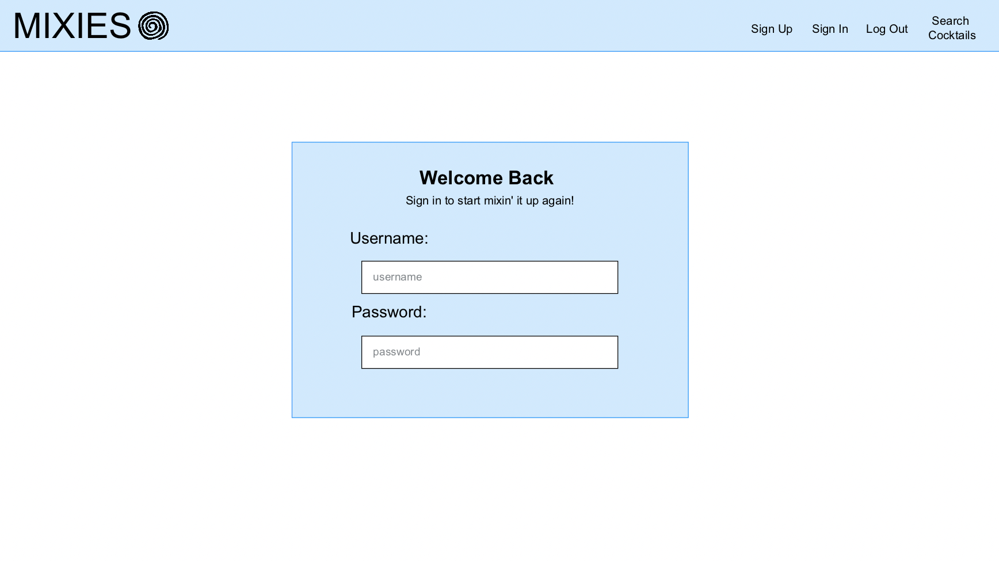
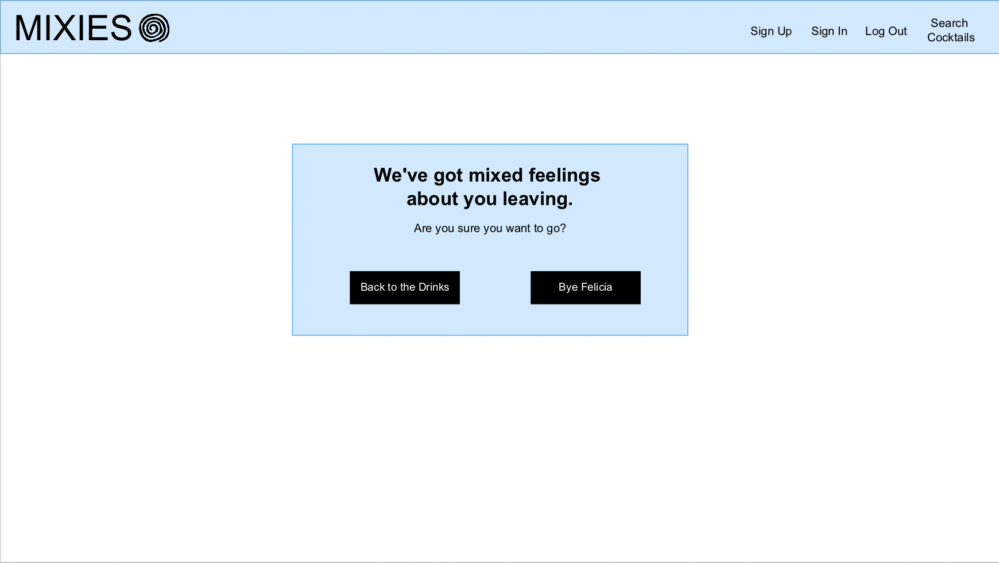
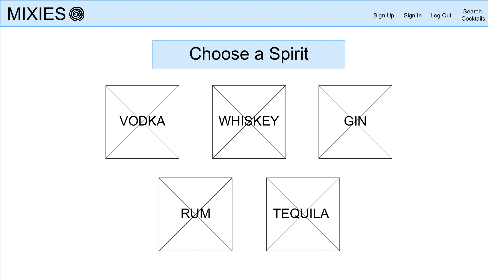
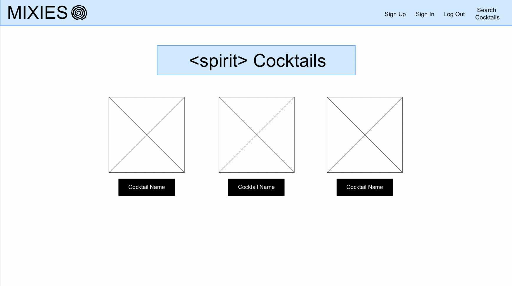
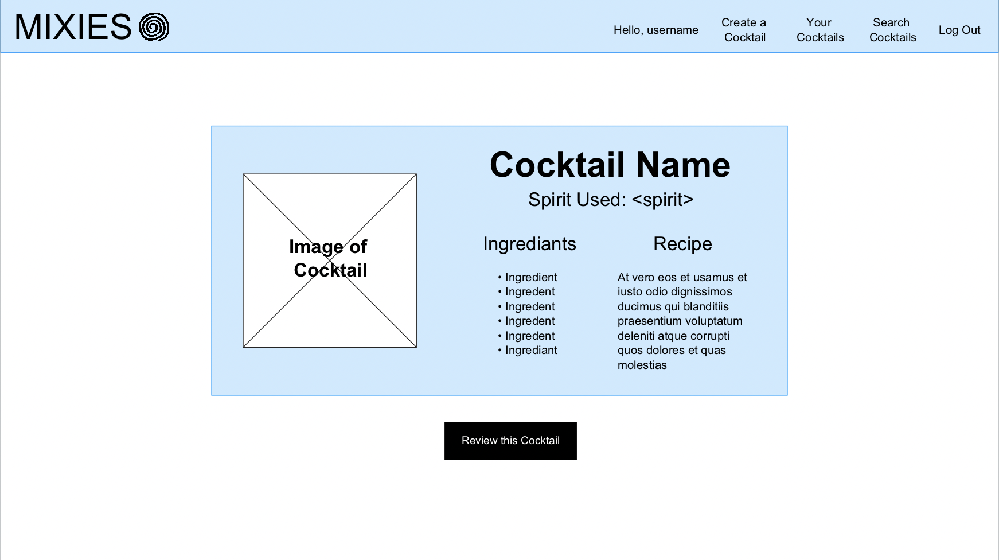
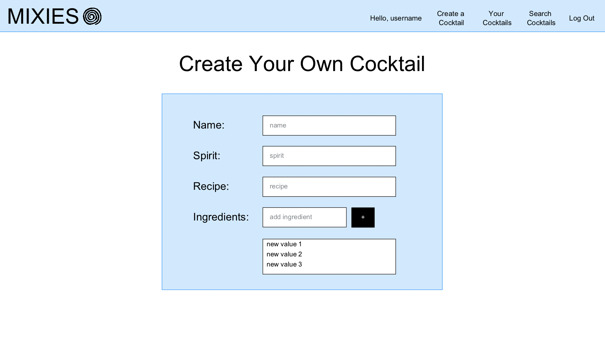
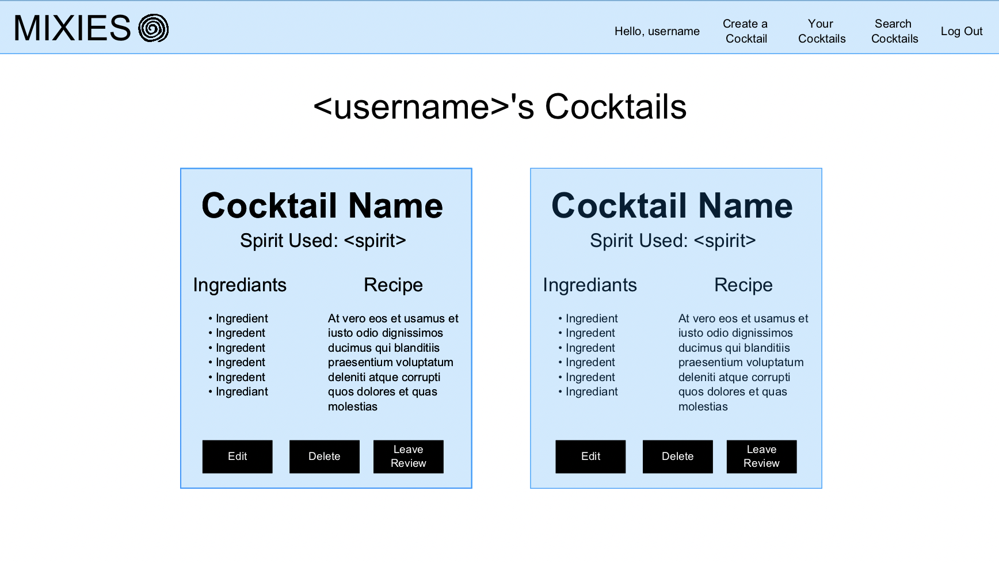

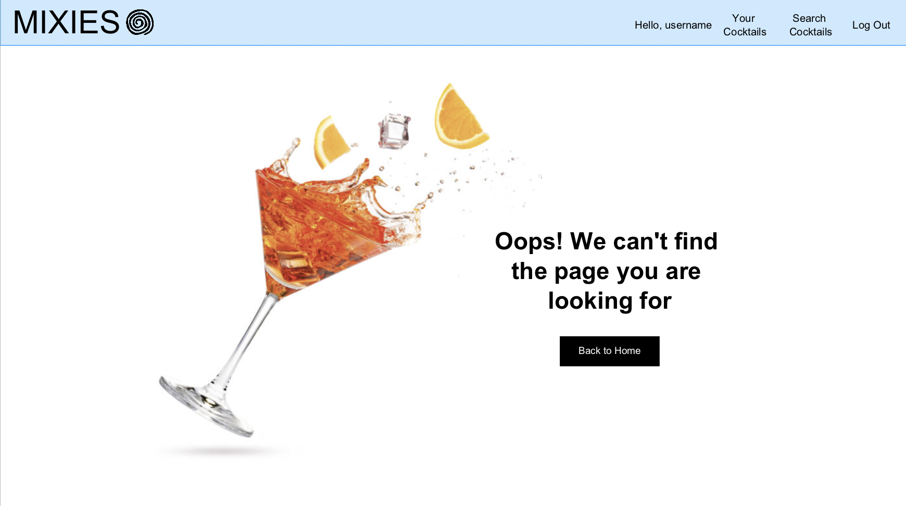
 
 
Plan for the Week:
 

- back-end initial set-up and seed complete
- spirit/cocktail/review controllers set-up
- user controllers set-up
- front-end set up
- styling
